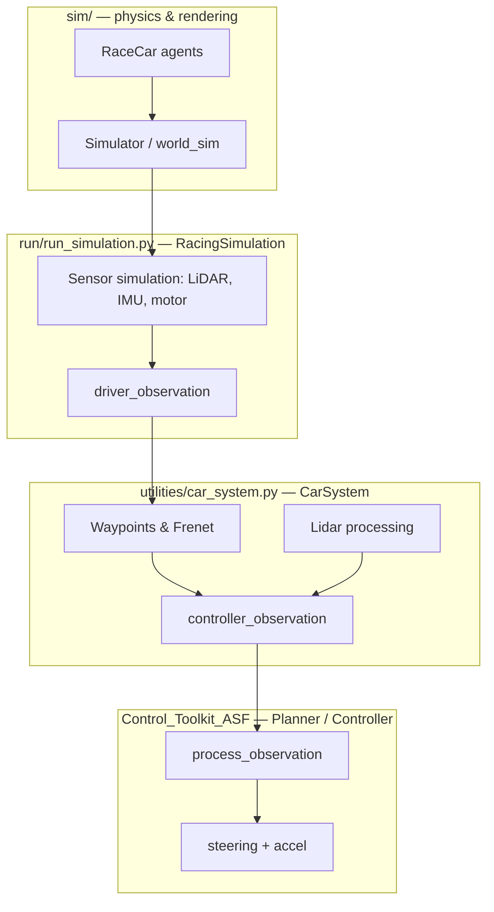

[](https://github.com/F1Tenth-INI/f1tenth_development_gym/actions/workflows/ci.yml)

F1TENTH development gym: physics simulation, classical controllers (MPC, Pure Pursuit, …), neural predictors (SI Toolkit), and reinforcement learning (TrainingLite). The same car-driver abstraction runs in sim and on the physical car via the ROS bridge.

**Contents:** [Setup](#setup) · [Run](#run) · [Architecture & Observations](#architecture) · [Car Models](#car-models) · [Develop](#develop) · [SI Toolkit](#si-toolkit) · [TrainingLite / RL](#traininglite) · [RaceTuner](#racetuner)

## Setup

(Tested on Ubuntu20, MacOS at 2024-06-25)
Clone the repo including submodules

```bash
git clone --recurse-submodules git@github.com:F1Tenth-INI/f1tenth_development_gym.git
cd f1tenth_development_gym/
```

I highly recommend using [Conda](https://conda.io/projects/conda/en/latest/user-guide/install/index.html) for virtual environments.
First create a conda environment.

```bash
conda create -n f1t python=3.11
conda activate f1t
```

And now you can install the gym package.

```bash
pip install --user -e sim/
```

Install the SI Toolkit package.

```bash
pip install --user -e ./SI_Toolkit
```

```bash
pip install -e utilities/minimum_curvature_optimization/trajectory-planning-helpers
```

Done. Check if everything works with:

```bash
python run.py
```

## Troubleshooting

After renaming gym to sim (updating from an oplder to a newer verfsion of this project), the JIT compiled functions might still be cached. If you face errors of caching scripts, that are looking for f110_gym or similar, delete the jit cache by running:

```bash
rm -rf ~/.numba_cache
rm -rf ~/.cache/numba
```

Check if the submodules are present. The folder SI_Toolkit and Control_Toolkit should not be empty. If they are empty, run:

```bash
git submodule update --init --recursive
```

And then install the SI_Toolkit again

```bash
python -m pip install --user -e ./SI_Toolkit
```

## Quality of life

Add the aliases to .bashrc

```bash
echo -e "\nalias f1t='conda activate f1t'\nalias pypa='export PYTHONPATH=./'" >> ~/.bashrc
source ~/.bashrc
```

now you can use them like this

```bash
f1t
pypa
```

## Run

Run the simulation

```bash
python run.py
```

You can override any setting from `Settings.py` using command-line arguments. For example:

```bash
# Run with different map and controller
python run.py --MAP_NAME RCA2 --CONTROLLER pure_pursuit

# Run with custom simulation length and rendering
python run.py --SIMULATION_LENGTH 5000 --RENDER_MODE human_fast

# Run with browser backend renderer
python run.py --SIMULATION_LENGTH 5000 --RENDER_MODE human_fast --RENDER_BACKEND web

# Save recordings with custom settings
python run.py --SAVE_RECORDINGS True --MAP_NAME RCA1 --CONTROLLER sac_agent --SAC_INFERENCE_MODEL_NAME OriginalReward1

```

### Web Renderer (Browser)

The browser renderer uses:
- `RENDER_MODE` for pacing (`None`, `human`, `human_fast`)
- `RENDER_BACKEND` for backend selection (`pyglet`, `pygame`, `web`)

Example:

```bash
python run.py --RENDER_MODE human_fast --RENDER_BACKEND web
```

Then open: [http://localhost:8765](http://localhost:8765)

Controls in browser:
- `Space`: toggle follow-car / free camera
- Mouse wheel: zoom
- Left mouse drag: pan

Implementation notes:
- Backend server: `sim/f110_sim/envs/web_renderer.py`
- Browser client: `sim/f110_sim/envs/WebRenderer/index.html`
- Web overlay builder: `sim/f110_sim/envs/rendering/WebRenderer/overlay_builder.py`

All settings from [Settings.py](utilities/Settings.py) can be overridden this way.

If you are running from terminal, please run all python scripts from the project's root folder. You might want to export the Python Path env variable:

```bash
export PYTHONPATH=./
```

### Settings

Have a look at the Settings file: [Settings.py](utilities/Settings.py). This file gives you an idea of what can be adjusted in the gym.

Let's go through the most important ones:

- MAP_NAME: There are multiple maps available (from easy to quite tricky). Change the map name to face different challenges.
- CONTROLLER: We have implemented multiple controllers (again from easy to complicated). If you are new with F1TGym, checkout 'ftg' (Follow the Gap) first, then the 'pp' (Pure Pursuit) controller. There are a lot of Tutorials about how these controllers work online.
- SAVE_RECORDINGS: IF set to true, a Recording will be created (in the folder ExperimentRecordings), which contains all the information about the car state and sensory inputs during the simulation. Recordings can also be raplayed.

# Architecture

The codebase is organized in layers. Each layer adds information or logic on top of the one below.



| Layer | Main files | Responsibility |
|-------|------------|----------------|
| **sim → world** | `sim/f110_sim/envs/base_classes.py` | Low-level F1TENTH gym: `RaceCar` dynamics, `Simulator` multi-agent physics step, collision checks |
| **run_simulation → Race** | `run/run_simulation.py`, `run.py` | `RacingSimulation` orchestrates the race: loads map, runs physics substeps, simulates sensors, calls drivers, renders |
| **car_system → car driver** | `utilities/car_system.py` | Everything a physical car has in common: waypoints, lidar helpers, recording, reward, episode termination, planner instance |
| **planner / controller** | `Control_Toolkit_ASF/Controllers/` | Algorithm-specific logic: MPC, Pure Pursuit, SAC agent, neural imitator, … |

`run.py` is the entry point. It parses CLI overrides for `Settings.py` and starts `RacingSimulation.run_experiments()`.

The main car and opponents are all `CarSystem` instances in the `drivers` array:

```python
drivers = [main_car] + opponents  # see RacingSimulation.init_drivers()
```

The same layering is mirrored on the physical car via the ROS bridge: `driver_observation` matches what the real sensors publish.

## Observations

Observations are built in stages. Raw physics outputs are enriched at each layer until a planner (or RL policy) sees the features it needs.

### 1. Driver observation (`driver_observation`)

Built in `RacingSimulation.build_driver_observation()` from the physics world. This is the **raw sensor packet** — the same structure used on the real car.

| Field | Description |
|-------|-------------|
| `car_state` | 10-element state vector (see [Car State](#car-state)) |
| `scans` | Raw LiDAR ranges (1080 beams, 360°) |
| `sensors.imu` | Simulated IMU accelerations |
| `sensors.motor_sensors` | Motor angular velocity, ERPM, current, … |
| `env` | `time`, `sim_index`, `surface_friction` |
| `env_state` | Full-environment snapshot (all car states, controls, sim outputs) |
| `collision`, `terminated`, `interrupted`, `done` | Episode flags |

Sensors are derived from physics state history (`IMUSimulator`, `MotorSensorSimulator`, `LidarSimulator`), not from noisy odometry.

### 2. Controller observation (`controller_observation`)

Built in `CarSystem._build_controller_observation()` after waypoints and lidar have been updated. This is what every planner's `process_observation()` receives.

Adds on top of `driver_observation`:

| Field | Description |
|-------|-------------|
| `next_waypoints` | Look-ahead raceline window (s, x, y, ψ, κ, v, a, borders, …) |
| `state_history` | Recent `car_state` snapshots |
| `control_history` | Recent applied controls `[steering, accel]` |
| `frenet_coordinates` | `(s, d, e, ψ)` — progress, lateral offset, heading error |
| `processed_ranges` | Filtered/downsampled LiDAR used by controllers |
| `lidar_points` | LiDAR hit points in map coordinates |
| `imu`, `motor_sensors` | Flattened copies of sensor dicts |
| `virtual_opponent_*` | Opponent poses / clearance (when virtual opponents enabled) |

Enrichment steps inside `CarSystem.process_observation()`:

1. Update car state and sensors from `driver_observation`
2. Refresh nearest waypoint and look-ahead window
3. Process LiDAR (optionally inject virtual-opponent hits into the scan)
4. Run obstacle checks and raceline selection
5. Compute Frenet coordinates
6. Pass `controller_observation` to the planner

After the physics substep, `on_step_end()` adds reward, episode-termination info, and calls `planner.on_step_end()` for transition logging (RL).

### 3. Super observation (`super_obs`) — RL only

For the SAC agent (`sac_agent` controller), `RLAgentPlanner._build_super_observation()` collects everything available for feature engineering:

- `car_state`, `state_history`, `imu`, `motor_sensors`
- `next_waypoints`, `border_points` (track bounds relative to waypoints)
- `lidar_ranges`, `lidar_history` (multi-frame LiDAR buffer)
- `last_actions` (last 3 normalized actions)
- `frenet_coordinates`, `global_waypoint_vel_factor`
- `pp_action` — Pure Pursuit fallback used during warmup
- `env_state`

### 4. Policy observation — RL feature vector

The actual SAC input is built by `build_observation(super_obs)` in:

`TrainingLite/rl_racing/observation_builder_template.py`

At training start the learner server copies this template into `TrainingLite/rl_racing/models/<model_name>/client/observation_builder.py`. The default builder concatenates (with manual scaling):

- State history (velocities, yaw rate, steering)
- Waypoint curvatures
- Downsampled track border points
- Last actions
- Frenet `(d, e)`
- Downsampled target speeds
- Pure Pursuit fallback action
- Multi-frame downsampled LiDAR
- IMU accelerations

Edit the template to change the policy input. **Start a new model name** if you change feature order, dimension, or scaling — old checkpoints are tied to the schema.

See also `TrainingLite/rl_racing/Readme.md` for the full async SAC pipeline.

## Planner vs Controller

**Planner** (`Control_Toolkit_ASF/Controllers/`): car-environment specific. Gathers and formats data, may embed a controller (Pure Pursuit) or wrap a system-agnostic one (MPC + Control Toolkit).

**Controller** ([Control Toolkit](https://github.com/SensorsINI/Control_Toolkit) submodule): system agnostic. Receives objectives (errors, references) and outputs control — the same MPC core runs on the F1TENTH car and on CartPole.

## Car State

The car state is a fixed-order array defined in `utilities/state_utilities.py` (indices are alphabetical by name):

| Variable | Description |
|----------|-------------|
| `angular_vel_z` | Yaw rate |
| `linear_vel_x`, `linear_vel_y` | Body-frame velocities |
| `pose_theta`, `pose_theta_cos`, `pose_theta_sin` | Yaw angle and trig helpers |
| `pose_x`, `pose_y` | Global position |
| `slip_angle` | Slip angle at vehicle center (deprecated, kept for compatibility) |
| `steering_angle` | Front wheel steering angle |

Always index by name, e.g. `s[POSE_X_IDX]`. See [TUM CommonRoad vehicle models](https://gitlab.lrz.de/tum-cps/commonroad-vehicle-models/-/blob/master/vehicleModels_commonRoad.pdf?ref_type=heads) for background — our index order differs.

# Car Models

Vehicle dynamics and geometry are configured via YAML files in `utilities/car_files/`.

| Setting | Purpose |
|---------|---------|
| `ENV_CAR_PARAMETER_FILE` | Parameters for the **simulated** car (physics, geometry, tire model) |
| `CONTROLLER_CAR_PARAMETER_FILE` | Parameters the **controller / predictor** assumes — can differ to simulate model mismatch |
| `SIM_ODE_IMPLEMENTATION` | Which dynamics backend `RaceCar` uses |

Available parameter files include `gym_car_parameters.yml`, `yokomo1_car_parameters.yml`, `ini_car_parameters.yml`, `mpc_car_parameters.yml`, and `gym_car_parameters_finetune.yml`.

### Dynamics backends (`SIM_ODE_IMPLEMENTATION`)

| Value | Description |
|-------|-------------|
| `jax_pacejka` | Fast JAX Pacejka tire model (default for simulation) |
| `pacejka` / `std` | NumPy implementations |
| `ODE_TF` | SI Toolkit batch model — same dynamics used inside MPC predictors |
| `residual` | Pacejka + learned residual correction (`TrainingLite/dynamic_residual_jax`) |

Key parameters in the YAML files: wheelbase (`l_wb`, `lf`, `lr`), mass and inertia (`m`, `I_z`), Pacejka coefficients (`C_Pf`, `C_Pr`), steering/accel limits, friction (`mu`), and sensor mount positions for IMU simulation.

The dynamics code lives in `sim/f110_sim/envs/` and `SI_Toolkit_ASF/car_model.py` (for `ODE_TF`).

## Waypoint

A waypoint is an array with indices defined in `utilities/waypoint_utils.py`:

| Index | Field | Description |
|-------|-------|-------------|
| `WP_S_IDX` | s | Curvilinear distance along raceline |
| `WP_X_IDX`, `WP_Y_IDX` | x, y | Position |
| `WP_PSI_IDX` | ψ | Heading |
| `WP_KAPPA_IDX` | κ | Curvature |
| `WP_VX_IDX`, `WP_A_X_IDX` | v, a | Target speed and acceleration |
| `WP_D_LEFT_IDX`, `WP_D_RIGHT_IDX` | borders | Distance to track bounds |

Waypoints are stored per map as `<MAP_NAME>_wp.yaml`. Access by name, e.g. `wp[WP_X_IDX]`.

For a new map, generate waypoints via minimum-curvature optimization (fast driving) or draw-by-hand (simple).

## Map

All maps are loceted at utilities/maps/
A map called [ExampleMap] consist of a folder at utilities/maps/ExampleMap/` containing the following files:

- `ExampleMap.yaml` - Contains meta information about the resolution etc.
- `ExampleMap.pgm` - Original image of the map (from SLAM on physical car)
- `ExampleMap.png` - Original image in .png format (used by localiyation stack on phcsical car, should not be changed!)
- `ExampleMap_wp_min_curve.png` - Map that's used to calculate minimum curvature waypoints (can be editted to contain a closed contour)
- `ExampleMap_wp_hand.png` - Is used to create waypoints by hand

(only present after waypoint generation)

- `ExampleMap_wp.yaml` - List of waypoints in classic direction
- `ExampleMap_wp_reverse.yaml` - List of waypoints in reverfse direction
- `data/` - Containing image processing and other data of the map

# Develop

Please work on your own branches and do pull requests to the main branch.
If possible, separate your code into your own folders.

Every planner must implement `process_observation(self, controller_observation)` and return `(angular_control, translational_control)`. The observation is the enriched `controller_observation` dict described above — not the legacy raw lidar/odom interface.

```python
def process_observation(self, controller_observation):
    car_state = controller_observation["car_state"]
    next_waypoints = controller_observation["next_waypoints"]
    # ...
    return angular_control, translational_control
```

## Control Toolkit

[Control Toolkit](https://github.com/SensorsINI/Control_Toolkit) is a system-agnostic submodule with the cores of MPC, MPPI, RPGD, and other controllers. Application-specific wrappers for this gym live in `Control_Toolkit_ASF/`.

Config files:

- `Control_Toolkit_ASF/config_controllers.yml`
- `Control_Toolkit_ASF/config_optimizers.yml`
- `Control_Toolkit_ASF/config_cost_function.yml`

### MPC Controller

MPC is available with two optimizers: **MPPI** and **RPGD**. Cost functions are in `Control_Toolkit_ASF/Cost_Functions/` (template: `f1t_cost_function.py`).

# SI Toolkit

[SI Toolkit](https://github.com/SensorsINI/SI_Toolkit) (`SI_Toolkit/` submodule) provides neural system identification, predictors, Brunton plotting, and online learning. Application-specific files for this project are in `SI_Toolkit_ASF/`.

| Component | Location | Purpose |
|-----------|----------|---------|
| Car dynamics model | `SI_Toolkit_ASF/car_model.py` | Kinematic, Pacejka, and neural dynamics used by MPC (`ODE_TF`) |
| Training config | `SI_Toolkit_ASF/config_training.yml` | Network architecture, data paths, hyperparameters |
| Testing config | `SI_Toolkit_ASF/config_testing.yml` | Brunton test reference recordings and models |
| Predictors config | `SI_Toolkit_ASF/config_predictors.yml` | Predictor selection for controllers |
| Online learning | `SI_Toolkit_ASF/config_onlinelearning.yml` | Adapt predictor weights during driving |
| Run scripts | `SI_Toolkit_ASF/run/` | Data generation, preprocessing, training, Brunton test |

Install during setup: `pip install --user -e ./SI_Toolkit`

## Neural Imitator (INItator)

Collect experiment recordings with a controller of choise (fe. MPC - MPPI).

- For a higher variance data, set control noise up to 0.5

NOISE_LEVEL_TRANSLATIONAL_CONTROL = 0.5
NOISE_LEVEL_ANGULAR_CONTROL = 0.5

- Tune the controller for robustness ( it needs to be able to complete laps reliably )
- Delete all old experiment recordings in ExperimentRecordings/
- Set EXPERIMENT_LENGTH such that the car completes more than 2 laps
- set NUMBER_OF_EXPERIMENTS >= 10 depending on how much data you want to have
- Run experiments

- Create the following folders:
  - SI_Toolkit_ASF/Experiments/[Controller Name]/Recordings/Train
  - SI_Toolkit_ASF/Experiments/[Controller Name]/Recordings/Test
  - SI_Toolkit_ASF/Experiments/[Controller Name]/Recordings/Validate
- Distribute the experiment's CSV files into these 3 folders ( each 80%, 10%, 10% of the data points)
- in config_training.yml set path_to_experiment to [Controller Name]

- Create normalization file:

```bash
python SI_Toolkit_ASF/run/Create_normalization_file.py
```

- Check the histograms if training data makes sense
- in config_training.yml set NET_NAME, inputs and training settings
- Train Network:

```bash
 python SI_Toolkit_ASF/run/Train_Network.py
```

- create a file at SI_Toolkit_ASF/Experiments/[Controller Name]/Models/[Model Name]/notes.txt and write minimal documentation about the network (Maps, Controller, Settings, thoughts etc...)
  Congratulations, the Neural Controller is now ready to use.

## Run Neural Imitator

- in Settings.py, select the neural controller and the model name
- Deactivate the control noise
- Deactivate control averaging (NN does not like it )

```python
CONTROLLER = 'neural'
...
PATH_TO_MODELS = 'SI_Toolkit_ASF/Experiments/[Controller Name]/Models/'
NET_NAME = '[Model Name]'
...
NOISE_LEVEL_TRANSLATIONAL_CONTROL = 0.0
NOISE_LEVEL_ANGULAR_CONTROL = 0.0
...
CONTROL_AVERAGE_WINDOW = (1, 1)
...
```

- Make sure that the control_inputs in config_training.yml and nni_planner.py match. (Otherwise correct them in nni_planner)
- Run experiment
  Enjoy your realtime neural network MPPI imitator (or how we call it: the INItator).

## Brunton Test

Check config_testting.yml:

- Select a file in experiment recordings for reference
- Select the network you want to test

```bash
python SI_Toolkit_ASF/run/A3_Run_Brunton_Test.py
```

## Neural Predictor

## Data Generation

To generate data, the best and fastest way is to use the data generator:

- Settings: `DataGen/config_data_gen.yml`
- Run: `python3 -m SI_Toolkit_ASF.run.run_data_generator_for_ML_Pipeline`

The provided settings are the ones that were found to work best for a time step of 0.04s. For other time steps, they might need to be adjusted. This creates a new folder in `SI_Toolkit_ASF/Experiments` with the data split into a train, test and validation folder.

## Data preprocessing

To remove outliers and add a derivative column, we need to preprocess the data.

- Settings: Everything need to be adjusted in the code itself (`SI_Toolkit_ASF/run/preprocess_data.py`)
- Run: `python3 -m SI_Toolkit_ASF.run.preprocess_data`

To only add derivative columns to the dataset:

- Run: `python3 -m SI_Toolkit_ASF.run.Add_derivative_to_csv`
- Settings: Adjust directly in file `SI_Toolkit_ASF/run/Add_derivative_to_csv.py`

## Training

To train, we first need to rename the columns of our training data. Use your IDE to rename all instances of `[translational]/[angular]_control_applied` in your dataset to `[translational]/[angular]_control`.

Then we need to create the normalization file:

- Settings:`SI_Toolkit_ASF/config_training.yml` and specify the desired `path_to_experiments`
- Run: `python3 -m SI_Toolkit_ASF.run`

Then set the desired model in `config_training.yml`. Settings that worked well are:

- Dense: `NET_NAME: 'Dense-128H1-128H2'`, 20 epochs, batch size of 32, wash out length 0, post wash out length 1, shift_labels 1 (important!).
- LSTM: `NET_NAME: 'Dense-128H1-128H2'`, 20 epochs, batch size of 32, wash out length 10, post wash out length 1, shift_labels 1.

Then run the training:

- Settings: `SI_Toolkit_ASF/config_training.yml`
- Run: `python3 -m SI_Toolkit_ASF.run.Train_Network`

## Evaluation

To check that your predictor works, run the Brunton test using:

- Settings: `SI_Toolkit_ASF/config_testing.py`
- Run: `python3 -m SI_Toolkit_ASF.run.Run_Brunton_Test`

# TrainingLite

`TrainingLite/` contains lightweight ML modules that extend the gym without pulling in the full SI Toolkit training stack.

| Module | Path | Purpose |
|--------|------|---------|
| **RL Racing** | `TrainingLite/rl_racing/` | Async SAC learner server + actor client for end-to-end RL |
| **Dynamic residual (JAX)** | `TrainingLite/dynamic_residual_jax/` | Learned residual on top of Pacejka dynamics (`SIM_ODE_IMPLEMENTATION = residual`) |
| **MPC imitator** | `TrainingLite/mpc_immitator_mu/` | PyTorch GRU imitator for MPC control sequences |
| **Slip prediction** | `TrainingLite/slip_prediction/` | Slip-angle predictor |
| **Visualization** | `TrainingLite/Visualization/` | Web-based training / experiment visualization |

## RL Training with Learner Server

RL uses an **async SAC** setup: a **learner server** trains on a replay buffer while one or more **actors** (simulation clients) collect transitions over TCP. See `TrainingLite/rl_racing/Readme.md` for full details.

```
[ Simulator + sac_agent ]  ──TCP──►  [ Learner Server (SAC) ]
        actor                              replay buffer + GPU training
```

### Quick start (recommended)

Start server and simulation together:

```bash
python TrainingLite/rl_racing/run_training.py \
  --auto-start-client \
  --CONTROLLER sac_agent \
  --SIMULATION_LENGTH 200000 \
  --save-model-name MyModel-1
```

The server waits for the actor, ingests `(obs, action, reward, next_obs, done)` episodes, trains SAC periodically, and broadcasts updated weights back to the actor.

### Hyperparameter sweeps

`TrainingLite/rl_racing/run_experiments.sh` shows batch experiment commands. Example pattern:

```bash
python TrainingLite/rl_racing/run_training.py \
  --auto-start-client \
  --batch-size 1024 \
  --learning-rate 3e-4 \
  --discount-factor 0.97 \
  --SAC_TARGET_UTD None \
  --SAVE_RECORDINGS False \
  --SAC_CHECKPOINT_FREQUENCY 500000 \
  --CONTROLLER sac_agent \
  --SIMULATION_LENGTH 200000 \
  --save-model-name Sweep-gamma_97-a
```

Common flags:

| Flag | Description |
|------|-------------|
| `--save-model-name` | New model directory under `TrainingLite/rl_racing/models/` |
| `--load-model-name` | Continue from an existing checkpoint |
| `--auto-start-client` | Launch `run.py` automatically as the actor |
| `--batch-size` | SAC minibatch size (overrides `SAC_BATCH_SIZE` for one run) |
| `--discount-factor` | SAC γ |
| `--SAC_CHECKPOINT_FREQUENCY` | Save checkpoint every N actor timesteps |
| `--SAC_TARGET_UTD` | Target update-to-data ratio (training steps per sample) |
| `--MAX_SIM_FREQUENCY` | Cap sim speed (useful when GPU training is the bottleneck) |

Physical-car oriented base training is in `TrainingLite/rl_racing/scripts/train_base_for_physical.sh`:

```bash
python TrainingLite/rl_racing/run_training.py \
  --auto-start-client \
  --CONTROLLER sac_agent \
  --MAP_NAME TheTrack2 \
  --SAC_TARGET_UTD 1.0 \
  --batch-size 512 \
  --SAC_CHECKPOINT_FREQUENCY 50000 \
  --SIMULATION_LENGTH 250000 \
  --MAX_SIM_FREQUENCY 250 \
  --RANDOM_WAYPOINT_VEL_FACTOR True \
  --save-model-name Physical-51
```

### Manual two-terminal setup

Terminal 1 — learner server:

```bash
python TrainingLite/rl_racing/run_training.py --SIMULATION_LENGTH 300000 --save-model-name MyModel-1
```

Terminal 2 — actor (simulation):

```bash
python run.py --CONTROLLER sac_agent
```

### Inference

Evaluate a trained policy without the server:

```bash
python run.py \
  --CONTROLLER sac_agent \
  --SAC_INFERENCE_MODEL_NAME MyModel-1 \
  --RENDER_MODE human_fast \
  --SIMULATION_LENGTH 2000
```

### Custom observations

Edit `TrainingLite/rl_racing/observation_builder_template.py`, then start training with a **new** `--save-model-name`. The server copies the template into the model's `client/` folder.

# Generate miminum Curvature Waypoints

- Select the map yopu want to create the waypoints in Settings.py => MAP_NAME
- Make sure there is a valid MAP_NAME.yaml and MAP_NAME_wp_min_curve.png file in the map folder
- If there is no MAP_NAME_wp_min_curve, you can just copy and rename the original map PNG
- In the MAP_NAME_wp_min_curve.png, you can draw corrections, do deliver a nice closed contour.
- Set the MIN_CURV_SAFETY_WIDTH in Settings.py. Note that the car's width is included. It should not be < 0.8m.
- Run the script:

```bash
python run/create_min_curve_waypoints.py
```

The waypoints (and additional data) will be saved in the map folder.

# RaceTuner

We can modify the raceline / speed profile with the RaceTuner.
Check RaceTuner/RunerSettings.py.

- Remote: True: Directly operate on the currrent map on the RaceCar, False: Operate on the local map
- Remote config: For connection to the physical car

Run RaceTunder:

```bash
export PYTHONPATH=./
python RaceTuner/WaypointsEditor.py
```

You can drag&drop any point from the race line / speed profile. Ctrl/Cmd + s to save the waypoints either on the maps folder or on the remote machine.

# Info by the original authors

This is the repository of the F1TENTH Gym environment.

This project is still under heavy developement.

You can find the [documentation](https://f1tenth-gym.readthedocs.io/en/latest/) of the environment here.

## Known issues

- Library support issues on Windows. You must use Python 3.8 as of 10-2021
- On MacOS Big Sur and above, when rendering is turned on, you might encounter the error:

```
ImportError: Can't find framework /System/Library/Frameworks/OpenGL.framework.
```

You can fix the error by installing a newer version of pyglet:

```bash
$ pip3 install pyglet==1.5.11
```

And you might see an error similar to

```
gym 0.17.3 requires pyglet<=1.5.0,>=1.4.0, but you'll have pyglet 1.5.11 which is incompatible.
```

which could be ignored. The environment should still work without error.

## Citing

If you find this Gym environment useful, please consider citing:

```
@inproceedings{okelly2020f1tenth,
  title={F1TENTH: An Open-source Evaluation Environment for Continuous Control and Reinforcement Learning},
  author={O’Kelly, Matthew and Zheng, Hongrui and Karthik, Dhruv and Mangharam, Rahul},
  booktitle={NeurIPS 2019 Competition and Demonstration Track},
  pages={77--89},
  year={2020},
  organization={PMLR}
}
```
