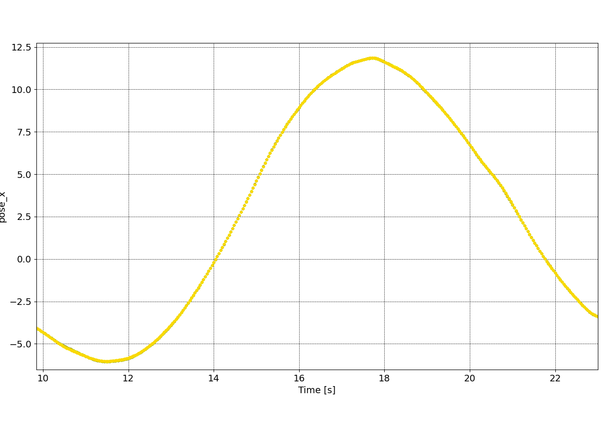
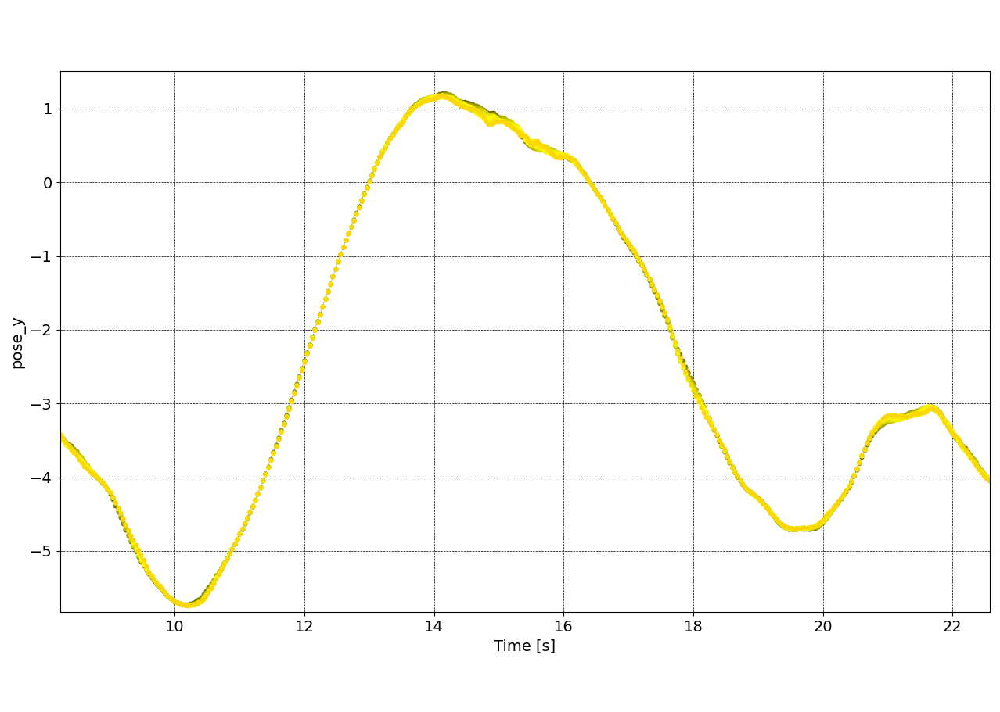
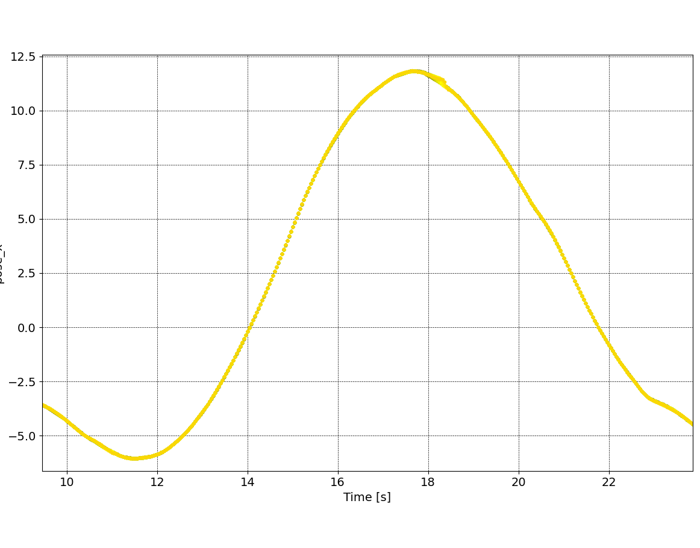
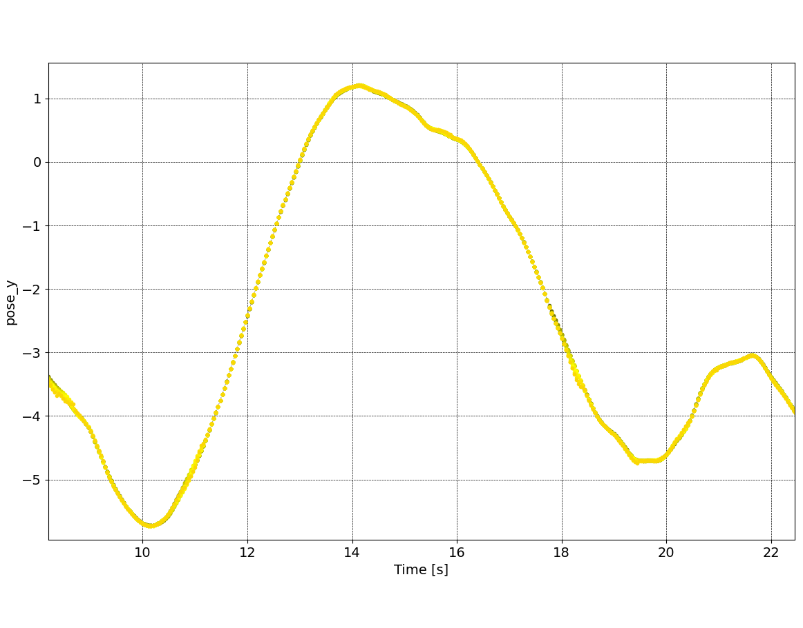

# Evaluation of networks without slip angle

We trained two models, both wihtout any slip angle information, one DNN and one LSTM. The LSTM uses a wash out length of 20.

## Results

The MSE over 15 timesteps  on two laps of hangar 12 are:

| State          | DNN   | LSTM  |
| ---------------- | ------- | ------- |
| Angular vel    | 0.10  | 0.15  |
| Linear vel     | 0.017 | 0.022 |
| Theta cos      | 0.023 | 0.032 |
| Theta sin      | 0.021 | 0.043 |
| Pose x         | 0.022 | 0.025 |
| Pose y         | 0.038 | 0.026 |
| Steering angle | 0.008 | 0.016 |

Some pictures:

DNN

LSTM

## Conclusion

We see that while the DNN learned almost every state better than the LSTM, the prediction of the position is much better in the LSTM than the DNN. While there are some outliers in the prediction of the pose_x in the LSTM, the pose_y prediction is much better. Most likely this is due to the LSTM inferring the slip angle from the last few states.
